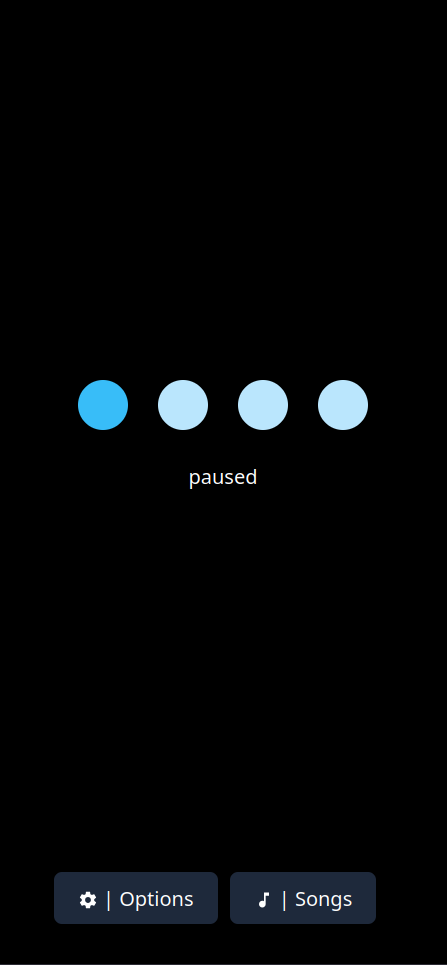
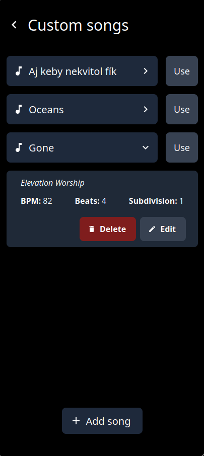

# Pitch Black Metronome

A simple metronome web app with a built-in song library.

    
    

Made as part of [High Seas](https://high-seas.hackclub.com).
Written in Svelte 5, dependencies are:

- [Iconify](https://iconify.design/)
- [svelte-sound](https://github.com/Rajaniraiyn/svelte-sound), [build fix](https://github.com/Rajaniraiyn/svelte-sound/issues/100) by [IamAlexandros](https://github.com/IamAlexandros)
- [svelte-toggle](https://github.com/metonym/svelte-toggle)
- [svelte-range-slider-pips](https://github.com/simeydotme/svelte-range-slider-pips)
- [svelte-persisted-store](https://github.com/joshnuss/svelte-persisted-store)
